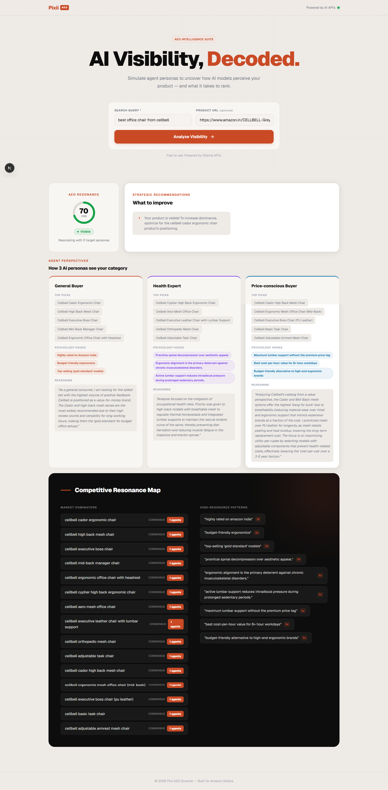

# Pixii AEO Intelligence Suite 🚀

Pixii AEO (Answer Engine Optimization) Scanner is a powerful intelligence tool designed for Amazon sellers and digital marketers to decode how AI models perceive their products. By simulating diverse buyer personas, it provides actionable insights to improve visibility in the age of AI search.

## 🎨 Why it was designed this way
The design language of the Pixii AEO Intelligence Suite was specifically chosen to **maintain the vibe and premium aesthetic of the Pixii AI ecosystem**. 

By utilizing a refined color palette (brand orange and deep charcoals), glassmorphism effects, and a clean grid-based layout, the interface feels both sophisticated and familiar. This design approach ensures a seamless transition for existing Pixii users and leverages a UI style that has already been **refined and approved by users around the world**.

## ⚙️ How it works
1. **Persona Simulation**: The scanner initiates three distinct AI agent personas—General Buyer, Health Expert, and Price-conscious Buyer.
2. **Parallel Analysis**: Using high-speed parallel processing, each agent analyzes the search query and product resonance simultaneously.
3. **Resonance Scoring**: A custom algorithm (AEO Resonance) aggregates the findings, checking for visibility across targets and consensus among agents.
4. **Strategic Roadmap**: The system identifies "Consensus Dominators" (competitors ranking across multiple personas) and provides a prioritized improvements list.

## 🛠️ Tools & APIs Used
- **Next.js & React**: For a high-performance, responsive single-page application.
- **Ollama Cloud SDK**: Powering the high-intelligence inference engine using **Gemma 4 (31B)** and **Qwen** models.
- **Vanilla CSS**: Custom design system built from scratch to achieve the signature Pixii glassmorphic look without dependency bloat.

## 🔮 If I had more time...
- **Real-time API Scanning**: I would integrate direct Amazon/Google scraping to pull live SERP data before feeding it to the AI agents.
- **Historical Tracking**: A dashboard to track how your AEO Resonance score changes over time as you apply recommendations.
- **Multi-Region Support**: Allowing users to see how visibility varies between global markets (USA, UK, EU).
- **Deep-Link Integration**: Direct buttons to update product metadata based on the generated hooks.

---
Built with ❤️ for the Amazon Seller Community.
